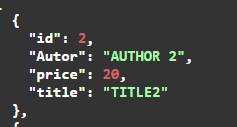
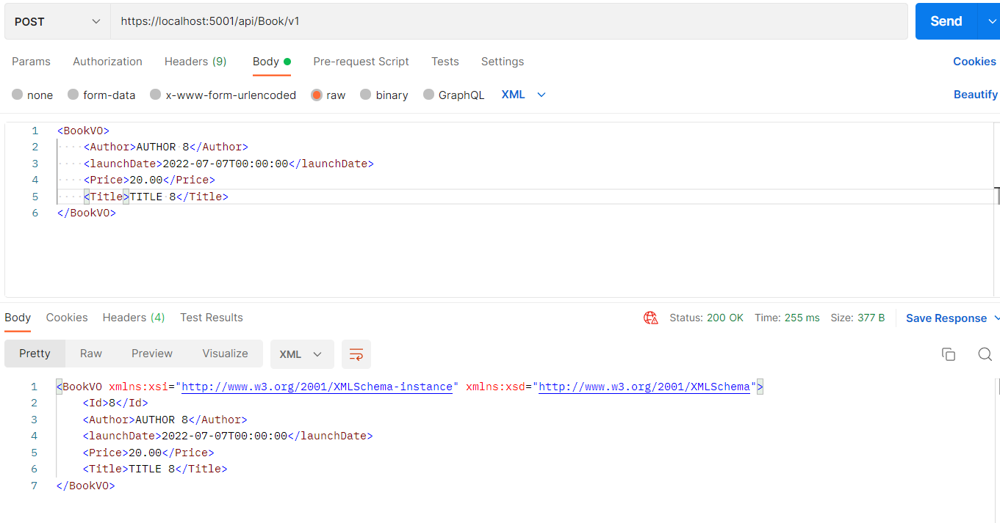

# 1. API-Rest

Construção de uma API-Rest baseada em um curso

Requisitos:

- SDK .Net 5.0;
- MySql;
- MySql Workbench;
- Docker for Windows;
- Postman;

-------

# 2. Sumário
<br>

- [1. API-Rest](#1-api-rest)
- [2. Sumário](#2-sumário)
- [3. Criar a Solution](#3-criar-a-solution)
- [4. Criar o projeto](#4-criar-o-projeto)
- [5. Adicionar o projeto na solution](#5-adicionar-o-projeto-na-solution)
- [6. Adicionar o .gitignore](#6-adicionar-o-gitignore)
- [7. Criar uma Controller(CalculadoraController)](#7-criar-uma-controllercalculadoracontroller)
- [8. Criar a Model e Service](#8-criar-a-model-e-service)
- [9. Postman](#9-postman)
- [10. Conexão com MySql](#10-conexão-com-mysql)
- [11. Versionamento de EndPoints](#11-versionamento-de-endpoints)
- [12. Alterações na arquitetura do projeto](#12-alterações-na-arquitetura-do-projeto)
- [13. Migrations](#13-migrations)
- [14. Generic Repository](#14-generic-repository)
- [15. Padrão de Projeto VO(Value Object)](#15-padrão-de-projeto-vovalue-object)
- [16. Custom Serialization](#16-custom-serialization)
- [17. Content Negociation](#17-content-negociation)
- [18. HATEOAS (Hypermedia As the Engine Of Application State)](#18-hateoas-hypermedia-as-the-engine-of-application-state)

--------

# 3. Criar a Solution
<br>

    dotnet new sln --name RestWithASPNET

---------

# 4. Criar o projeto
<br>

    dotnet new webapi -o RestWithASPNET -f net5.0

-------

# 5. Adicionar o projeto na solution
<br>

    dotnet sln add .\RestWithASPNET\RestWithASPNET.csproj

------

# 6. Adicionar o .gitignore
<br>

    dotnet new gitignore
    git add .gitignore

---------

# 7. Criar uma Controller(CalculadoraController)
<br>

1. Deletar os arquivos WeatherForecast.cs e WeatherForecastController.cs;
2. Criar a "CalculadoraController.cs" em Controllers;
3. Herdar de ControllerBase e inserir as Annotations \[ApiController] e \[Route("\[controller]")];
4. Criar os métodos usando Annotation \[Http{Get/Post/Put/Delete}("rota/{parametro}")];

>Obs. é possível alterar as portas e urls da aplicação em Properties, launchSettings.json;

----

# 8. Criar a Model e Service
<br>

1. Criar o diretório Model e a entidade/classe com as propriedades(Person.cs);
2. Criar o diretório Services e a Interface com os métodos da entidade criada na Model(IPersonService.cs);
3. Criar a classe concreta que implementa os métodos da interface (PersonServiceImplementation.cs);
4. Na classe Startap adicionar o serviço usando `services.AddScoped<Interface, Classe_que_a_implementa>();`
5. Crie a controller PersonController e faça a injeção de dependência de IPersonService;

-----

# 9. Postman
<br>

É um ferramenta capaz de fazer requisições com outros verbos http além do GET, muito utilizado para testar rotas de APIs;

Como utilizar:

1. Escolha o verbo/método http, por exemplo \[POST];
2. Insira a rota, ex.: http://localhost:5000/api/person ;
3. Dependendo do verbo utilizado, insira o as informações no header (se necessário);
4. Dependendo do verbo utilizado, insira o as informações no body (se necessário/sempre verifique o formato utilizado JSON, XML...);


> Obs. pode ser necessário desativar a verificação de certificado SSL no postman para que o mesmo funcione.

----

# 10. Conexão com MySql
<br>

1. Para fazer a conexão com com o Banco de Dados MySql é necessário instalar o pacote Pomelo.EntityFrameworkCore.MySql. Isso pode ser feito usando alguma extensão do NuGet ou pelo comando abaixo:

        dotnet add .\RestWithASPNET\  package Pomelo.EntityFrameworkCore.MySql --version 5.0.4

2. Criar a classe de contexto, Context > MySqlContext.cs;
3. Inserir a ConnectionString no appsettings.json;
4. Configurar a ConnectionString no Startup.cs;
5. Dependendo do ambiente, pode ser necessário utilizar algumas Annotations na Entidade, como: 
   - `[Table("nome_tabela")]` - faz o bind com o nome de uma tabela (em caso de nomes de tabelas diferentes);
   - `[Column("atributo")]` - faz o bind com uma coluna na tabela (em caso de nomes de colunas diferentes);

-----

# 11. Versionamento de EndPoints
<br>

O versionamento de EndPoints é importante para que a API continue funcionando para seus clientes mesmo após atualizações no código. Logo, aqueles que consumiam a versão inicial de sua aplicação(v1.0) podem continuar a utiliza-la sem a necessidade imediata de migrar para a nova versão (v2.0);

Uma forma de versionar a aplicação seria usar as rotas:

**Versão v1.0**

`https://localhost:5001/api/v1.0/controller`

**Versão v2.0**

`https://localhost:5001/api/v2.0/controller`

<br>

Também é possível utilizar pacotes de versionamento como o `Microsoft.AspNetCore.Mvc.Versioning`, onde é possível fazer o versionamento por namespace, pela rota, etc.

    dotnet add package Microsoft.AspNetCore.Mvc.Versioning --version 5.0.0

Após instalar o pacote adicionar a configuração na classe Startup.cs

```c#
services.AddApiVersioning();
```

Para usar na Controller:

```c#
[ApiVersion( "1.0" )] //Esta annotation
[ApiController]
[Route( "[controller]/v{version:apiVersion}" )]//versão
public class PeopleController : ControllerBase
{
    [HttpGet]
    public IActionResult Get() => Ok( new[] { new Person() } );
}
```

[Link do reposítório](https://github.com/dotnet/aspnet-api-versioning/wiki/New-Services-Quick-Start#aspnet-web-api-with-odata-v40)

-----

# 12. Alterações na arquitetura do projeto
<br>

O projeto será separado em camadas, apesar do projeto ficar mais complexo ele divide as tarefas mantendo o código menor e mais compreensível;

- Business fica responsável pelas regras de negócio (validações);
- Repository fica responsável apenas pela persistência dos dados;
  
<br>

**Trajeto da requisição até o banco de dados**

Controller -> Método Http -> Camada Business -> Repository -> Context -> BD;

<br>

**Etapas**

1. Renomear o diretório e todos os namespaces de Services para Business, incluindo as diretivas using;
2. Copiar a pasta Business e colar em RestWithASPNET, na sequência renomear a cópia para Repository;
3. Em Repository renomear IPersonService para IPersonRepository, e IPersonServiceImplementation para IPersonRepositoryImplementation, também alterando namespaces e referências;
4. Em PersonController substituir todos os service por business também;
5. Alterar a injeção de dependência em PersonBusinessImplementation para `private readonly IPersonrepository _repository` alterando também o construtor e os métodos quando necessário;
6. Atualizar a classe Startup, adicionando AddScoped() tanto para a camada Business quanto para Repository; 

----

# 13. Migrations
<br>

As migrações são um forma de atualizar/criar o banco de dados automáticamente (sem criar as tabelas manualmente). Elas facilitam o desenvolvimento e tem como vantagem criar um histórico, e permitindo reverter para versões anteriores.

As migrações usam seu arquivo de contexto e as Classes em suas propriedades DbSet<> para criar as tabelas. Ex.:

```c# 
public DbSet<Person> Persons { get; set; }
```

Os comandos usados para fazer migrações e atualizar as tabelas no banco de dados são:

    dotnet ef migrations add <nome_da_migração>
    dotnet ef database update

> Obs. É necessário ter o pacote `Microsoft.EntityFrameWorkCore.Tools` para usar o comando `dotnet ef` .

<br>

**Outras extensões úteis para trabalhar com migrações**

- [Evolve](https://www.nuget.org/packages/Evolve/3.1.0-alpha7#usedby-body-tab) ;
- [Serilog](https://www.nuget.org/packages/Serilog/2.11.1-dev-01397) ;
- [Serilog.AspNetCore](https://www.nuget.org/packages/Serilog.AspNetCore/6.0.0-dev-00265) ;
- [Serilog.Sinks.Console](https://www.nuget.org/packages/Serilog.Sinks.Console/4.0.2-dev-00890) ;
- [MySql.Data](https://www.nuget.org/packages/MySql.Data) ;

1. Após inserir todas as dependências acima, inserir `public IWebHostEnviroment Enviroment { get;}` na classe Startup.cs e seu construtor;
2. Adicionar `Log.Logger = new LoggerConfiguration().WriteTo.Console().CreateLogger();` no construtor da classe Startup.cs;
3. Adicionar a condição `if(Environment.IsDevelopment())
            {
                MigrateDatabase(connectionString);
            }` no ConfigureServices() na classe Startup.cs;

4. Criar o método `MigrateDatabase()` na classe Startup.cs;
5. Criar os diretórios db/dataset e db/migrations no diretório RestWithASPNET;
6. Criar o arquivo `V1__Create_Table_Person.sql` em migrations, conforme documentação do Evolve;
7. Criar o arquivo `V2__Populate_Table_Person.sql` em dataset, conforme documentação do Evolve;
8. Basta rodar o projeto e o Evolve aplica automáticamente as migrações;

> Obs. Ele cria uma tabela para controlar as alterações. 
> 
> Novas migrations devem ter seu nome alterado para V3__, V4__ ...
>
>Tentar alterar uma migração vai gerar um erro, uma vez que ela já foi migrada;

----

# 14. Generic Repository
<br>

É muito semelhante ao DAO(Data Access Object), mas este visa apenas acesso ao banco de dados. O Generic Repository visa criar uma forma genérica para implementar os repositórios, que são muito semelhantes. Caso alguma entidade precise de um método diferente é possível fazer um método de extensão somente para atender as diferenças.

No projeto, os passos para implementar o Generic Repository são:

1. Criar o diretório Models -> Base;
2. Nele, criar a classe BaseEntity;
3. Criar o diretório Repository -> Generic;
4. Nele, criar a Interface IRepository;
5. Criar também a Classe Generic Repository;
6. Fazer Injeção de dependência do contexto(MySql) na Generic Repository;
7. Usar um DbSet<T> para que qualquer entidade passada seja alterada no context (Sem precisa inserir `public DbSet<Entidade> Entidades` para cada entidade no context);
8. Adicionar no Startup.cs : `services.AddScoped(typeof(IRepository<>), typeof(GenericRepository<>));` ;

**Usar o Generic Repository no lugar BookRepository**

1. Remover os arquivos IBookRepository e BookRepositoryImplementation;
2. Remover o AddScopped de IbookRepository do Startup.cs;
3. Na Model Book, extender Base Entity e remover a propriedade Id;
4. Injetar o IRepository em BookBusinessImplementation no lugar de IBookRepository;

> Perceba que com o repositório genérico não precisariamos das Interfaces e Classes I{Classe}Repository e {Classe}RepositoryImplementation.
>
>Caso fosse necessário uma implementação diferente seria possivel extender o GenericRepository;
>
>Não farei as alterações em Person, para visualizar como é sem o GenericRepository.

----

# 15. Padrão de Projeto VO(Value Object)
<br>

Também pode ser chamado de DTO(Data transfer object), é utilizado para não expor a estrutura de sua API. O que ocorre é que o client que consome sua API vai interagir com o VO/DTO que você expõe, este passa pela controller, camada de business, repository sendo convertido/adaptado para a Entidade e por último é feita a persistência dos dados;

1. Criar os diretórios em RestWithASPNET:
   - Data/Converter/Contract ;
   - Data/Converter/Implementations ;
   - Data/VO ;

2. Em Contract, criar IParser;
3. Em VO criar as classes PersonVO e BookVO;
4. Em Implementations criar PersonConverter e Book Converter;
5. Alterar o BusinessImplementation(Book e Person) para utilizar os VOs (no caso farei somente para o Book, pois não implementei o Generic Repository no Person);
6. Ajustar IBookBusiness e IPersonBusiness(só foi feito no Book);
7. Ajustar o Controller;


> O VO/DTO pode ser diferente da Entidade;
> 
>Repare no Swagger que agora é exposto BookVO ao invés de Book;

----

# 16. Custom Serialization
<br>

Custom Serialization permite alterar os nomes de atributos apresentados ao Client. Os nomes alterados devem ser utilizados no envio de requisições também.

É possível fazer estas alterações com as seguintes notações:

`[JsonPropertyName("outro_nome")]` , `[JsonIgnore]` ;

Ex.:

```c#
    public class BookVO
    {
        public int Id { get; set; }
        [JsonPropertyName("Autor")]
        public string Author { get; set; }
        [JsonIgnore]
        public DateTime launchDate { get; set; }
        public decimal Price { get; set; }
        public string Title { get; set; }
    }
```
<center>



</center>

> Obs. Em outras versões do SDK, como 3.1 ou anteriores é feito de outra maneira, que já foi deprecada;

-----

# 17. Content Negociation
<br>

Content Negociation serve para expor outros formatos de dados, por exemplo, até o momento só utilizamos JSON, mas existem outros formatos como o XML.

Para isso é necessário usar o pacote `Microsoft.AspNetCore.Mvc.Formatters.Xml`:

        dotnet add package Microsoft.AspNetCore.Mvc.Formatters.Xml --version 2.2.0

Na sequência inserir a configuração abaixo na Classe Startup.cs, no ConfigureServices():

```c#
    services.AddMvc(options =>
    {
        options.RespectBrowserAcceptHeader = true;
 
        options.FormatterMappings.SetMediaTypeMappingForFormat("xml", "application/xml");   
        options.FormatterMappings.SetMediaTypeMappingForFormat("json", "application/json");   
    }).AddXmlSerializerFormatters();
```

<center>



</center>

------

# 18. HATEOAS (Hypermedia As the Engine Of Application State)
<br>

HATEOAS são "hypermidias", quando alguém faz uma requisição a sua API ele devolve o resultado e junto os links com as ações possíveis para aquele resultado. Facilita a navegação entre recursos;

1. Criar as Interfaces "IResponseEnricher" e "ISupportHyperMedia" no diretório Hypermedia/Abstract;
2. Criar as Classes Seladas "HttpActionVerb", "RelationType" e "ResponseTypeFormat" em Hypermedia/Constants;
3. Criar as Classes "HyperMediaFilter" e "HyperMediaFilterOptions" em Hypermedia/Filters;
4. Criar a Classe "HyperMediaLink" e a Classe Abstrata "ContentResponseEnricher" em Hypermedia;
5. Implementar a Interface ISupportsHyperMedia em BookVO;
6. Criar a Classe "BookEnricher" em HyperMedia/Enricher;
7. Ajustar a classe Startup com filterOptions:

```c#
            var filterOptions = new HyperMediaFilterOptions();
            filterOptions.ContentResponseEnricherList.Add(new BookEnricher());

            services.AddSingleton(filterOptions);
```

8. Adicionar o endpoint na classe Startup:

```c#
            app.UseEndpoints(endpoints =>
            {
                endpoints.MapControllers();
                endpoints.MapControllerRoute("DefaultApi", "{controller=values}/{id?}");
            });
```

9. Adicionar a annotation em todos os métodos da controller Book `[TypeFilter(typeof(HyperMediaFilter))]`, exceto no Delete retorna NoContent();

Agora o HATEOAS deve estar funcionando ao fazer requisições para BookController;

-----


